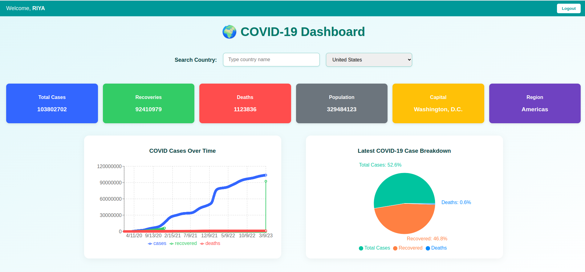

# 🌍 COVID-19 Dashboard Web Application

A fully responsive and authenticated COVID-19 dashboard built with **React** and **Firebase**, displaying real-time and historical pandemic data globally. Users can **register, login**, and access an interactive dashboard with visual charts, statistics, and country-specific details.

---

## 🚀 Features

- 🔐 **User Authentication** – Sign up, login, logout, and account deletion using Firebase Authentication.
- 🌐 **Global Country Selection** – Search or select a country from a dropdown list to view detailed COVID-19 statistics.
- 📊 **Data Visualizations** – View historical trends via line charts and current stats in pie charts.
- 📅 **Historical Data** – Timeline data of cases, deaths, and recoveries from over 1500 days.
- 🗺️ **Country Information** – Displays population, capital, and region of the selected country.
- ⚡ **Fast and Responsive** – Clean UI design that adapts to all screen sizes.
- 🔒 **Protected Dashboard** – Dashboard is accessible only after successful login.
- 🔄 **Session Persistence** – Users stay logged in across sessions unless they explicitly log out.

---

## 🛠️ Tech Stack

- **Frontend:** React, React Router, CSS
- **Authentication:** Firebase Authentication
- **APIs Used:**
  - [disease.sh API](https://disease.sh/v3/covid-19/historical/{country}?lastdays=1500)
  - [REST Countries API](https://restcountries.com/v3.1/all)
- **Charts:** Recharts

---

## 📸 Screenshots

---

## 📂 Project Structure

src/
- ├── assets/               # Static assets and images
- ├── components/           # Chart and stat card components
- ├── pages/                # Login, Signup, Dashboard, FrontPage
- ├── utils/                # API helper functions
- ├── firebase.js           # Firebase configuration
- ├── App.js                # Routing and authentication logic
- └── index.js              # React entry point

## ✅ Getting Started

Follow these steps to set up the project on your local machine:

## 1. Clone the Repository

- git clone https://github.com/InaDewangan/COVID-19_Dashboard.git
- cd covid-dashboard-app

## 2. Install Dependencies
npm install

## 3. Firebase Configuration
1. Go to Firebase Console
2. Create a new project
3. Enable Email/Password Authentication

Create a .env file in the root directory and add your Firebase credentials like this:

.env
- REACT_APP_FIREBASE_API_KEY=your_api_key
- REACT_APP_FIREBASE_AUTH_DOMAIN=your_project_id.firebaseapp.com
- REACT_APP_FIREBASE_PROJECT_ID=your_project_id
- REACT_APP_FIREBASE_STORAGE_BUCKET=your_project_id.appspot.com
- REACT_APP_FIREBASE_MESSAGING_SENDER_ID=your_sender_id
- REACT_APP_FIREBASE_APP_ID=your_app_id

Make sure you've also updated firebase.js to read from environment variables

## 4. Run the Application
 npm start

 Then open: http://localhost:3000

## 🔌 API Details

📈 COVID-19 Historical Data
Endpoint:
 https://disease.sh/v3/covid-19/historical/{country}?lastdays=1500

Returns:
 Timeline of total cases, deaths, and recoveries for a country.

## 🌐 Country Info

Endpoint:
 https://restcountries.com/v3.1/all

Returns:
 Country data including name, population, region, capital, ISO codes.

## 🔐 Authentication Flow

✅ User signs up or logs in via Firebase.

🔐 On successful login, user is redirected to the protected dashboard.

🔁 Sessions persist until logout.

🗑️ Account deletion is supported after re-authentication.

## 🌍 Country Selection Flow

Users can:

🔎 Search for a country by name

📂 Select from the dropdown list

➡️ The dashboard updates automatically with the selected country's COVID-19 and general info.

## 🧑‍💻 Author

- Ina Dewangan
- GitHub: https://github.com/InaDewangan
- LinkedIn: https://www.linkedin.com/in/ina-dewangan